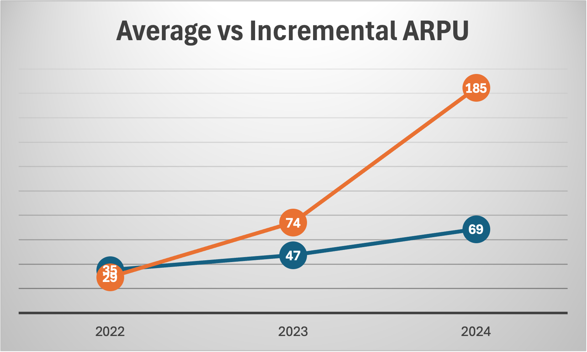

## Revenue Growth Significantly Outpaces User Growth

.png)

Indexed to 2020 = 100, Revolut’s revenue growth has materially outpaced user growth over the period.  
This divergence indicates that scaling has been driven primarily by **improving monetisation**, rather than by user acquisition alone.

## ARPU Expansion Reflects Increasing Monetisation Depth

Average Revenue per User (ARPU) has increased steadily from 2020 to 2024, reflecting deeper product penetration, higher engagement of mature users, and growing contribution from subscriptions, trading and FX-related revenues.

## Incremental ARPU Exceeds Average ARPU

From 2022 onwards, incremental ARPU consistently exceeds average ARPU, with a particularly sharp divergence in 2023–2024.  
This indicates that **newly acquired users monetise significantly better than the existing base**, pointing to improving customer quality and scalable growth dynamics.

2021 is excluded as a COVID / FX-driven outlier.

## Improving Unit Economics and Operating Efficiency

Revenue per employee has grown materially faster than operating expenses per employee, highlighting improving productivity and operating leverage as the platform scales.

## High-Quality, Cash-Backed Profitability

After excluding movements in customer balances, Revolut’s core operating cash flow turned strongly positive from 2023 onwards.  
Core operating cash flow consistently exceeds operating profit, indicating **high-quality, cash-backed earnings** rather than balance-sheet-driven cash inflows.

## Key Takeaway

Revolut’s growth is increasingly monetisation-driven, supported by improving unit economics and high-quality cash generation, suggesting a structurally stronger business as scale increases.
